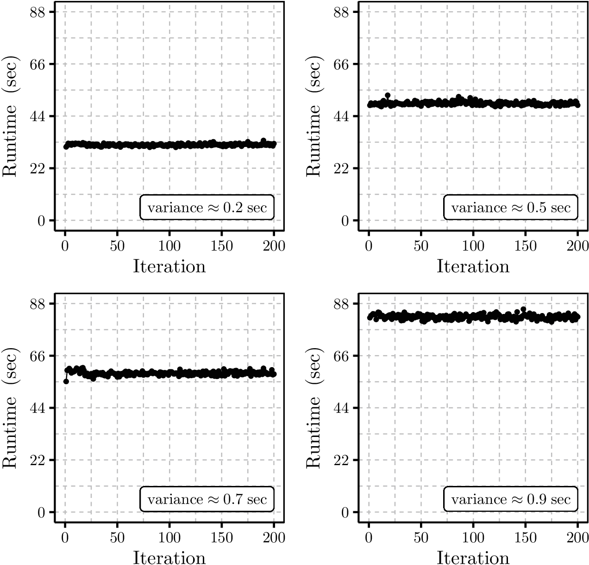

# Benchmarking Stan under Dynamic Overclocking with ThrottleStop

 

This repository holds digital assets associated with the article "Benchmarking
Stan under Dynamic Overclocking with ThrottleStop" [[1](#references)]. That
article discusses the impact of dynamic overclocking on benchmarking the Stan
probabilistic programming language. The ThrottleStop CPU throttling utility was
used to moderate overclocking for an example Bayesian inference task in
astronomy.

---

<figure>
  
  <figcaption>Figure 1. Example runtimes for Stan's Bayesian inference with and without system overclocking. Inference of type Ia supernovae cosmological parameters was used as an example problem. Runtime variance was lower under overclocking. Hyperthreading was counterproductive. Execution configurations, moderated by ThrottleStop, were...  

&nbsp;&nbsp; Top (left) overclocking, physical cores, (right) no overclocking, physical cores. 
&nbsp;&nbsp; Bottom (left) overclocking, logical cores, (right) no overclocking, logical cores.

Adapted from [<a href="#references">1</a>].</figcaption>
</figure>

---

## Table of Contents

- [Key Files](#key-files)
- [Software Requirements](#software-requirements)
- [Getting Started](#getting-started)
- [Acknowledgements](#acknowledgements)
- [References](#references)

## Key Files

| File                                    | Notes                                               |
| :-------------------------------------- | :-------------------------------------------------- |
| `src/stan-overclocking-benchmarker.Rmd` | R Markdown. Incorporates Stan's R interface, RStan. |

## Software Requirements

| Software               | Notes                                                                                                                                                                                               |
| :--------------------- | :-------------------------------------------------------------------------------------------------------------------------------------------------------------------------------------------------- |
| Ghostscript 10.00.0    | [Available here](https://ghostscript.com/). Free and fee-based options.                                                                                                                             |
| PowerShell             | Free. Included with Windows 11.                                                                                                                                                                     |
| R                      | [Available here](https://www.r-project.org/). Free.                                                                                                                                                 |
| RStudio                | [Available here](https://posit.co/products/open-source/rstudio). Free and fee-based options.                                                                                                        |
| ThrottleStop &nbsp; | [Available here](https://www.techpowerup.com/download/techpowerup-throttlestop/). Free. &nbsp;&nbsp;&nbsp;Recommended. The code was designed for use with ThrottleStop, but will run without it. |
| Windows 11             | Supported operating system.                                                                                                                                                                         |

### Ghostscript

The benchmarker assumes Ghostscript is available on the system. An invocation
path should be set in the RStudio environment variables `GS_CMD` and
`R_GSCMD`. I.e., the path to a relevant executable such as `gswin64c.exe`.

> [!NOTE]
> The code was not designed for Ghostscript more recent than version 10.00.0.

### Stan

Please ensure the R environment has the RStan package installed.

R and RStudio should be configured to enable execution of RStan code. For more
information, see: [The R Interface to Stan](https://mc-stan.org/rstan/).

## Getting Started

The file `stan-overclocking-benchmarker.Rmd` should be run from RStudio, with
administrator privileges. E.g., invoke RStudio via the Windows "Run as
administrator" option.

## Acknowledgements

This work was supported by the Australian Research Council Training Centre in
Data Analytics for Resources and Environments (project ICI9010031).

## References

1. T. N. Stenborg, "Benchmarking Stan under Dynamic Overclocking with
   ThrottleStop", in _Astron. Data Anal. Softw. Syst. XXXII_, vol. 538,
   S. Gaudet, D. Bohlender, S. Gwyn, A. Hincks and P. Teuben, Eds.,
   Astronomical Society of the Pacific, 2025, pp. 265&ndash;268, doi:
   10.26624/GAQB5323.\
   [View PDF](https://www.aspbooks.org/publications/538/265.pdf)
   &nbsp; [View at publisher](https://aspbooks.org/custom/publications/paper/538-0265.html)
   &nbsp; [SciX](https://scixplorer.org/abs/2025ASPC..538..265S/abstract)
